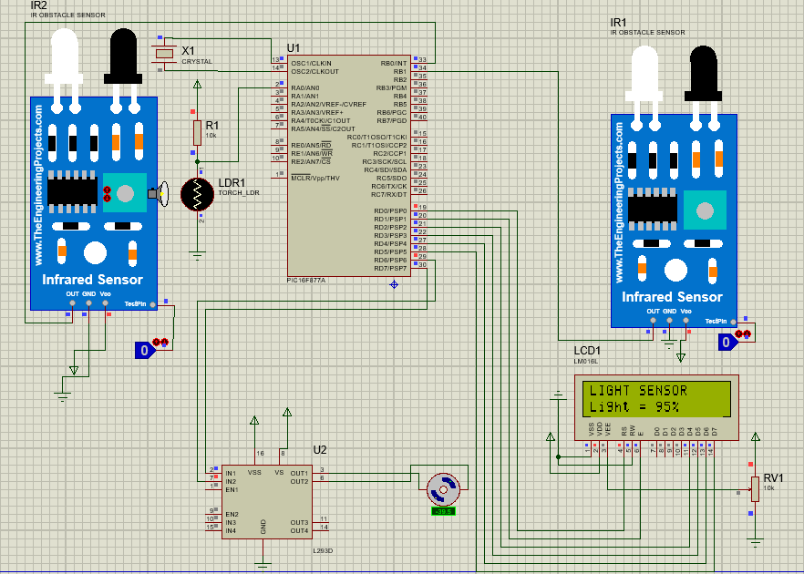

# Automatic Curtain Control System

This project uses a PIC16F877A microcontroller to control a curtain system based on ambient light levels. The system employs two IR sensors to detect curtain positions and an LDR sensor to measure light intensity.

## Components

- PIC16F877A Microcontroller
- L298 Motor Driver
- IR Sensors (2x)
- LDR Sensor
- Motor
- LCD Display

## Circuit Diagram

Refer to the provided circuit diagram for wiring instructions.

## Pin Configuration

- **IR_TOP**: RB0 (Pin 21)
- **IR_BOTTOM**: RB1 (Pin 22)
- **Motor Control Pins**: RD6 (Pin 15), RD7 (Pin 16)
- **LDR Sensor**: AN0 (RA0, Pin 2)
- **LCD**: Connected to PORTD (RD0 - RD5)

## Setup

1. Connect the IR sensors to RB0 and RB1.
2. Connect the motor control pins to RD6 and RD7.
3. Connect the LDR sensor to AN0 (RA0).
4. Connect the LCD to PORTD (RD0 - RD5).
5. Ensure the PIC16F877A is properly powered and connected.

## Functionality

- The system reads the light intensity using the LDR sensor.
- If the light intensity is above a certain threshold, the curtain opens.
- If the light intensity is below the threshold, the curtain closes.
- The IR sensors ensure the curtain stops at the desired positions.

## Code Explanation

- `read_ldr()`: Reads the light intensity from the LDR sensor and returns the value.
- `stopMotor()`: Stops the motor.
- `openCurtain()`: Opens the curtain until the top IR sensor is triggered.
- `closeCurtain()`: Closes the curtain until the bottom IR sensor is triggered.
- `setup()`: Initializes the I/O pins and stops the motor.
- `main()`: Main loop that continuously reads the light sensor and controls the curtain.

## How to Use

1. Compile the provided code using MikroC Pro for PIC.
2. Upload the compiled hex file to the PIC16F877A microcontroller.
3. Power the circuit and observe the automatic curtain control based on light levels.
